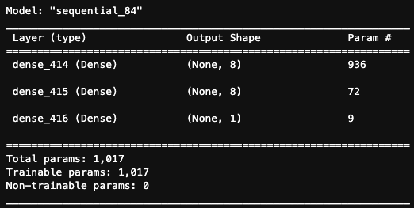
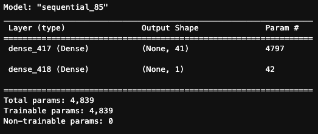
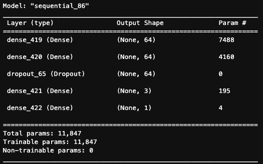

# Module-13-Challenge (Report)

## Alphabet Soup - Neural Networks

---

 

### <u>Overview of the Analysis</u>

 

<b>Purpose:</b>

The intention of this software was to develop a neural network program with the ability to predict whether a company could become financially successful if seed funded via a venture capital company. The dataset fit by the program model takes in dozens of property's/variables of the company listed as unique 'features' while the model trains to a simple historical binary 'success/unsuccessful' rating as target.

<b>Process & Variables:</b>

i.) The data is first prepared by reading the applicants_data.csv into a Pandas Dataframe. The Dataframe is then cleaned by first dropping the EIN (Employee Identification Number) & Name columns due to irrelevance. Afterwards, the categorical variables of the dataset are encoder into binary numerical values using OneHotEncoder library/module. The original non-categorical variables & the newly converted binary numerical variables are concatenated back into a single DataFrame.
 
 
ii.) The now preprocessed data is then split into feature variables (X) and the target (y='IS_SUCCESSFUL column values) datasets.
 
 
iii.) Afterwards, the features & target datasets are then split into training and test datasets. These are then run through the StandardScaler preprocessing module in order to normalize them for more accurate modelling results.
 
 
iv.) Next, a neural network is built using the Tensorflow module & associated libraries. The initial step to creating the first neural network layer is defining the number of input features (in the case of this model, there are 116 input features), the number of hidden layer nodes/neurons, the output neuron. Then the model is instantiated using the Sequential module and each layer with its own properties is added to the now defined model using a activation features that include Leaky Relu, Relu, and *Sigmoid (*for the output layer activation, specifically). The model is compiled using binary cross-entropy loss, the "adam" optimizer and defined to evaluate to produce an accuracy metric during each epoch iteration. The model is then fit with the previously created X-feature train scaled data (X_train_scaled). It is then fit to train toward the y-train dataset (using 25 epochs - on the initial model), again, previously defined during the splitting into training & test dataset step above.
 
 
v.) Finally, two more unique neural network's are created (nn_A1 & nn_A2) and individually defined using an experimental number of hidden node neurons, varying the number of hidden layers, changing the number of neurons on each particular layer, altering the activation function for the hidden layers and varying the number of epochs (iterations) run.

### <u>Results</u>

- Machine Learning Model 'nn':

  - Description of Model 'nn':

    - number_input_features: 116
    - number_output_neurons: 1
    - hidden_nodes_layer1: int(round(1/14 \* number_input_features,0)) = 8
    - hidden_nodes_layer2 = int(round(1/14 \* number_input_features,0)) = 8
    - first hidden layer features: nn.add(Dense(units=hidden_nodes_layer1, input_dim=number_input_features, activation="relu"))
    - second hidden layer features: nn.add(Dense(units=hidden_nodes_layer2, activation="relu"))
    - compile features: nn.compile(loss="binary_crossentropy", optimizer="adam", metrics=["accuracy"])
    - epochs: 25

    

    
    

  Results:

  - 268/268 - 1s - loss: 0.5583 - accuracy: 0.7313 - 701ms/epoch - 3ms/step
    Loss: 0.5583244562149048, Accuracy: 0.7313119769096375

 
 

- Alternative Machine Learning Model 'nn_A1':

  - Description of Model:

    - number_input_features: number_input_features = len(X_train.iloc[0]) = 116
    - number_output_neurons: 1
    - hidden_nodes_layer1_A1: 41
    - first hidden layer features: nn_A1.add(Dense(units=hidden_nodes_layer1_A1, input_dim=number_input_features, activation="relu"))
    - compile features: nn_A1.compile(loss="binary_crossentropy", optimizer="adam", metrics=["accuracy"])
    - epochs: 50

    

    
    

  Results:

  - Alternative Model 1 Results
    268/268 - 1s - loss: 0.7706 - accuracy: 0.7177 - 680ms/epoch - 3ms/step
    Loss: 0.7706049084663391, Accuracy: 0.7176676392555237

   
   

- Alternative Machine Learning Model 'nn_A2':

  - Description of Model:

    - number_input_features: number_input_features = len(X_train.iloc[0]) = 116
    - number_output_neurons: 1
    - hidden_nodes_layer1_A2: 64
    - hidden_nodes_layer2_A2: 64
    - first hidden layer features: nn_A2.add(Dense(units=hidden_nodes_layer1_A2, input_dim=number_input_features, activation=keras.layers.LeakyReLU(alpha=0.01)))
    - dropout/regularizer features:
      nn_A2.add(Dropout(.2,input_shape=(10,)))
      nn_A2.add(Dense(3, activation='relu', kernel_regularizer=l2(0.01), bias_regularizer=l2(0.01)))
    - output layer features: nn_A2.add(Dense(units=number_output_neurons_A2, activation="sigmoid"))
    - compile features: nn_A2.compile(loss="binary_crossentropy", optimizer="adam", metrics=["accuracy"])
    - fit model features:
      batch_size=50
      fit_model_A2 = nn_A2.fit(
      X_train_scaled,
      y_train,
      batch_size=batch_size,
      validation_data=(X_val,y_val),
      epochs=300)
      fit_model_A2
    - epochs: 300

    

    
    

  Results:

  - Alternative Model 2 Results
    268/268 - 1s - loss: 0.5726 - accuracy: 0.7325 - 576ms/epoch - 2ms/step
    Loss: 0.5726093053817749, Accuracy: 0.732478141784668

 
 

### <u>Summary</u>

Therefore, it was determined after some lengthy degree of experimentation that varying the number of hidden node layer neuron numbers & hidden node layer numbers seemed to be the greatest factor in altering the accuracy results through the designated epoch iterations. Having more than 2 hidden node layers did not lead to a drastic improvement upon the accuracy of the model as overall avg accuracy essentially oscillated between 71-74% max. Additionally, the biggest improvement appeared to come from enabling the Leaky Relu activation function, introducing random Dropout & Regularizer layers while simultaneously implementing validation data function with a batch size of around 50. This enable accuracies to improve to almost 74-75% midway through the nn_A2 epoch=300 run (even though the avg accuracy came out to 73.25% on the last nn_A2 modeling tweak).
